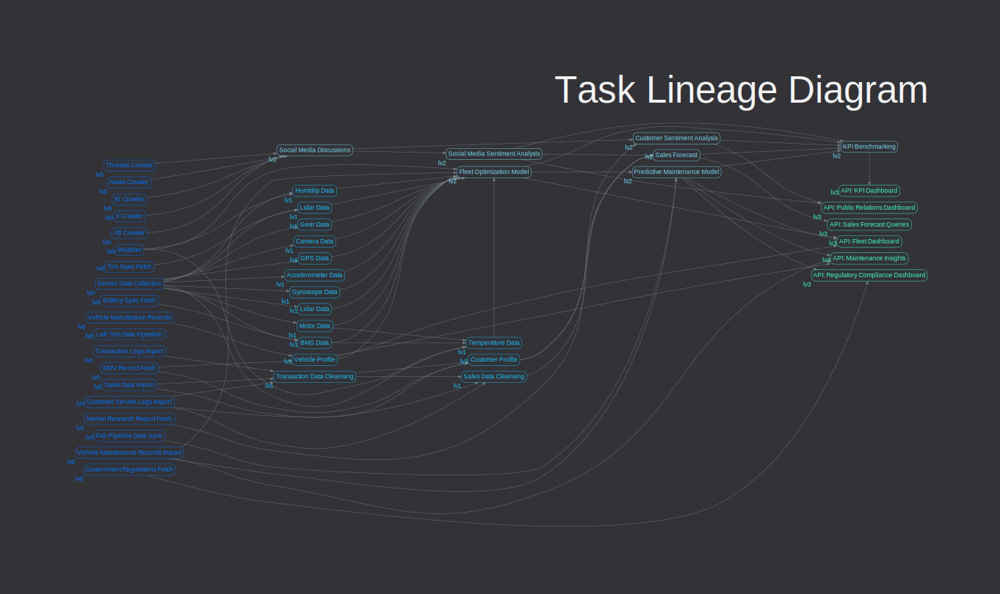
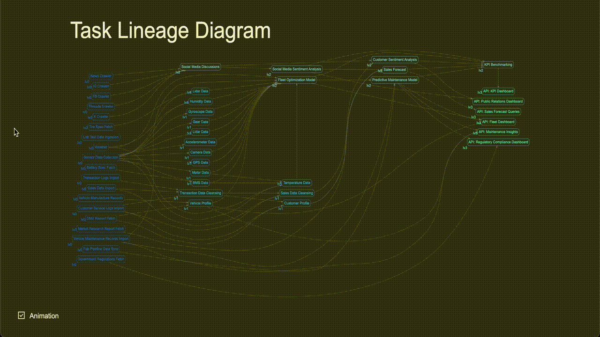
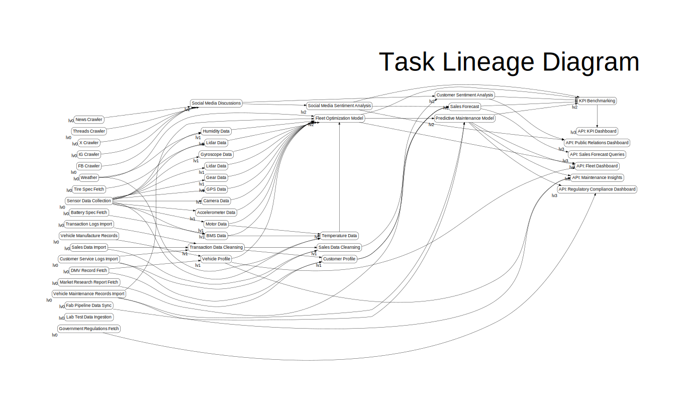
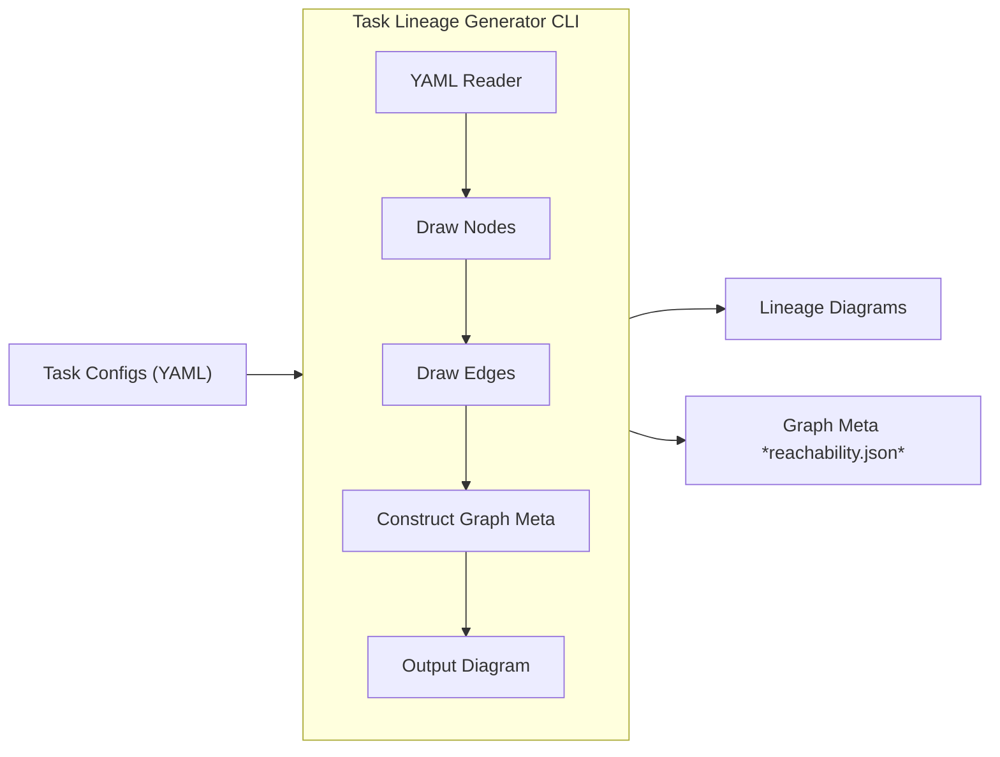

# Task Lineage Generator

A simple tool for rendering task lineage diagrams written in Golang.





## Usage

```text
Usage:
  tlg [flags]

Flags:
  -k, --config          Path for yaml config file. (default "config.yaml")
  -c, --color           Color mode. If turned on, the output is colored.
  -f, --format string   Output file format, one of [svg, dot, png, jpg]. (default "svg")
  -g, --group           Group Layer. If turned on, nodes under the same layer are grouped together, which means they are placed next to each other if possible. (recommended)
  -h, --help            help for tlg
  -i, --input string    Root directory for yaml files. (default ".")
  -l, --layout string   Graph Layout. Currently support [circo, dot, fdp, neato, osage, patchwork, sfdp, twopi]. (default "dot")
  -n, --no-reach        Turn this on to skip the reachability analysis.
  -o, --output string   Output file path. (default "graph")
  -r, --reach string    Output file path for the reachability analysis report. (default "reachability.json")
  -s, --size string     Graph size. Currently only support [fhd, a3]. (default "fhd")
```

## Run the Source

You need to have your Golang 1.20+ environment up and set, then you can do the following:

### Test Run

```sh
go run main.go {-i [taskYamlRootDir]} {-o [targetFile]} {-f [format]} {-g} {-l [layout]} {-c} {-n} {-r [reachabilityFile]}
```

For example

```sh
# for colored lineage
go run main.go -i ./mock-tasks -o dot.svg -f svg -l dot -c -g
# for bw lineage
go run main.go -i ./mock-tasks -o dot.svg -f svg -l dot -g
```




### Compile and Run

```sh
# compile
GOFLAGS=-mod=mod go build -o bin/tlg main.go

# run the binary
./bin/tlg {-i [taskYamlRootDir]} {-o [targetFile]} {-f [format]} {-g} {-l [layout]} {-c} {-n} {-r [reachabilityFile]}
```

## Project Organization

- `cmd`: for cli
- `dot`: graph construction and rendering
- `interface`: simple interactive web interface
- `mock-tasks`: a set of mock YAML files which simulates a real-world data pipeline configuration
- `reader`: YAML reader for reading task configurations
- `schema`: data schema

## Project Background

The data team I work with has developed a custom-built data pipeline consisting of ETL processes and machine learning models. When a task fails or is delayed, all subsequent tasks must be rerun. The challenge lies in determining the cascading effects of rerunning a task, as our pipeline includes over 250 tasks with complex interdependencies. Apart from common issues like data inconsistency and database overloads, understanding the downstream impact of an upstream task trigger has been a significant challenge. While Apache Airflow offers a clear solution, implementing it would require extensive resources—rewriting the entire pipeline, deploying to our servers, and getting the entire team up to speed. Given the constraints at the time, I set out to develop a simpler solution that could integrate seamlessly into our existing pipeline without code migration. I believed that a well-designed visualization tool would resolve the lack of clarity.

### Project Goal

- Visualize task lineages as Directed Acyclic Graphs (DAGs)
- Keep the solution as simple as possible
- Seamless integration with our existing pipeline
- Automatically refresh the visualization upon task specification (yaml) updates
- Provide interactivity to enhance usability

### Project Development

#### Technical Decisions

At the time, I frequently used GraphViz to create charts, and I realized it could be an ideal tool for visualizing task lineages. The key was to ensure it runs automatically whenever task specifications are updated. Since we use GitLab for version control, I leveraged GitLab CI to trigger jobs on code commits. The next question was how to encapsulate GraphViz within a CI environment and generate lineage diagrams from task specifications.

After some research, I found the Golang package [goccy/go-graphviz](https://github.com/goccy/go-graphviz), which provided all the necessary features, including graph representation and traversal via a Golang API. Along with the [YAML package](https://gopkg.in/yaml.v3) for reading task specifications, I was able to compile the entire project into a small binary that others could use, or package it into a Docker image for integration into CI tasks. The workflow was structured as follows:



And the setup for the CI/CD pipeline:

1. Import task configurations as submodules of a main repo
2. For every task configuration update, trigger main repo’s reference update to trigger its CI
3. Run Task Lineage Generator in main repo's CI
4. In the end of the CI, publish the lineage diagram

#### Interactive Interface

To enhance the diagram's usability, I developed a simple website to host the SVGs with basic interactivity. Staying true to the simplicity goal, I chose to avoid frameworks and used only HTML, CSS, and D3.js. This allowed me to implement essential features such as panning, zooming, highlighting, and tooltips to display detailed information for each task. This minimal yet effective interactivity resolved the clarity issues, providing a functional and user-friendly visualization tool. (see `/interface`)
