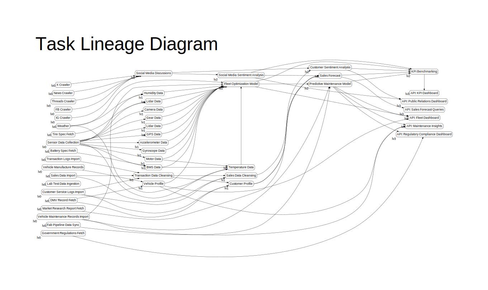

# Task Lineage Diagram

A simple golang module for rendering task lineage diagrams.




## Usage

```text
Usage:
  tld [flags]

Flags:
  -k, --config          Path for yaml config file. (default "config.yaml")
  -c, --color           Color mode. If turned on, the output is colored.
  -f, --format string   Output file format, one of [svg, dot, png, jpg]. (default "svg")
  -g, --group           Group Layer. If turned on, nodes under the same layer are grouped together, which means they are placed next to each other if possible. (recommended)
  -h, --help            help for tld
  -i, --input string    Root directory for yaml files. (default ".")
  -l, --layout string   Graph Layout. Currently support [circo, dot, fdp, neato, osage, patchwork, sfdp, twopi]. (default "dot")
  -n, --no-reach        Turn this on to skip the reachability analysis.
  -o, --output string   Output file path. (default "graph")
  -r, --reach string    Output file path for the reachability analysis report. (default "reachability.json")
  -s, --size string     Graph size. Currently only support [fhd, a3]. (default "fhd")
```

## Development

You need to have your golang environment up and set, then you can do the following:

### Test Run

```sh
go run main.go {-i [taskYamlRootDir]} {-o [targetFile]} {-f [format]} {-g} {-l [layout]} {-c} {-n} {-r [reachabilityFile]}
```

For example

```sh
go run main.go -i ./mock-tasks -o dot.svg -f svg -l dot -c -g
```

### Build and Run

```sh
GOFLAGS=-mod=mod go build -o bin/tld main.go
./bin/tld {-i [taskYamlRootDir]} {-o [targetFile]} {-f [format]} {-g} {-l [layout]} {-c} {-n} {-r [reachabilityFile]}
```
