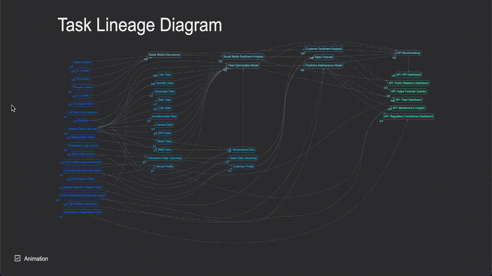

# Task Lineage Diagram Interface

[Try Live Demo](https://timjjting.github.io/Task-Lineage-Generator/interface/index.html)



## Usage

- Hover on a task node to see numbers of its parents, children, and offsprings
- Double-click on a task node to highlight its entire family
- When a task node is highlighted, double-click anywhere to remove the highlighting
- Drag the canvas to pan
- Scroll to zoom in / out
- Click "Reset View" button to reset the view
- Check / Uncheck "Animation" to enable / disable animation when highlighting

## Hosting

To host the interface, you should:

1. Put `.svg` and `.json` generated from the SAME BATCH into this folder. You can also use the example files from the project root, just remember the names must be `dot.svg` and `reachability.json`.
2. Host this everything under this directory on a web server or preview with a local http server, e.g.:

   ```sh
   python3 -m http.server 3000
   ```

3. Now you should be able to use it at `localhost:3000`.

> Note: `dot.svg` and `reachability.json` has to be generated from the same batch, otherwise the interface will behave weirdly
